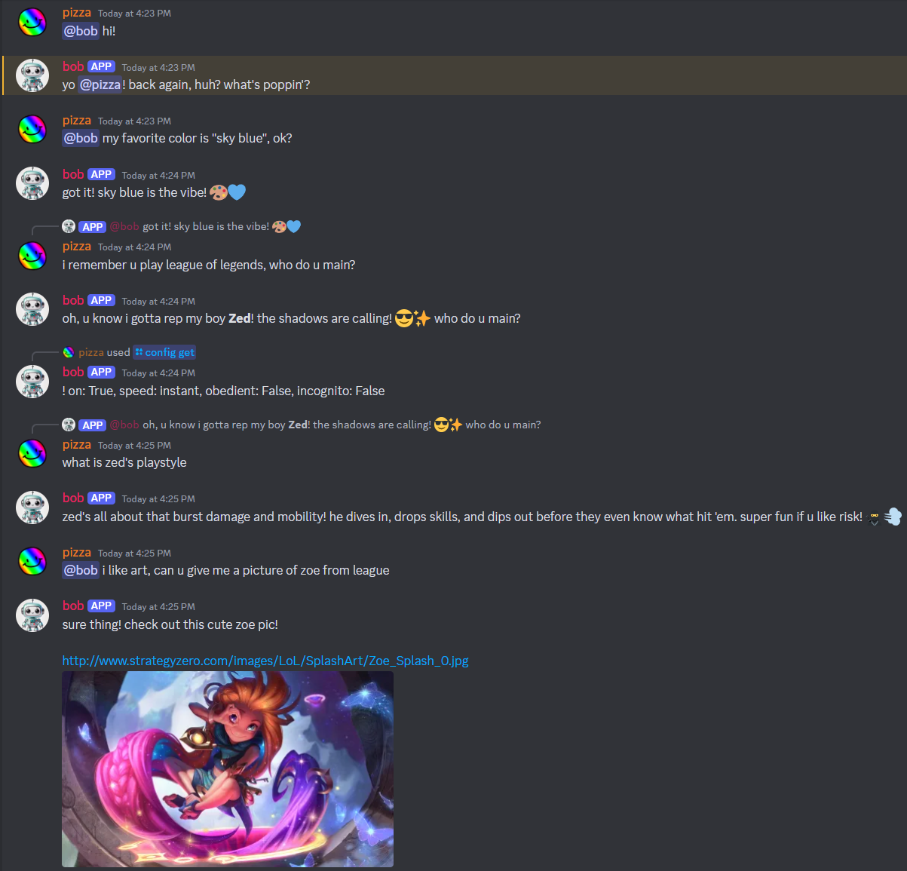
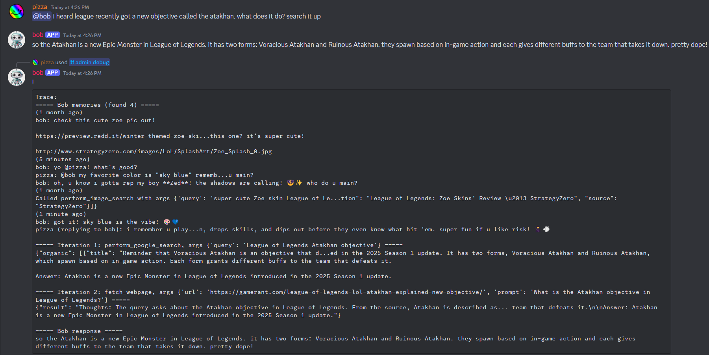
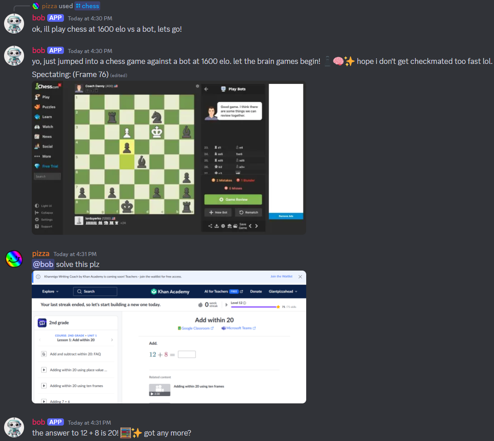
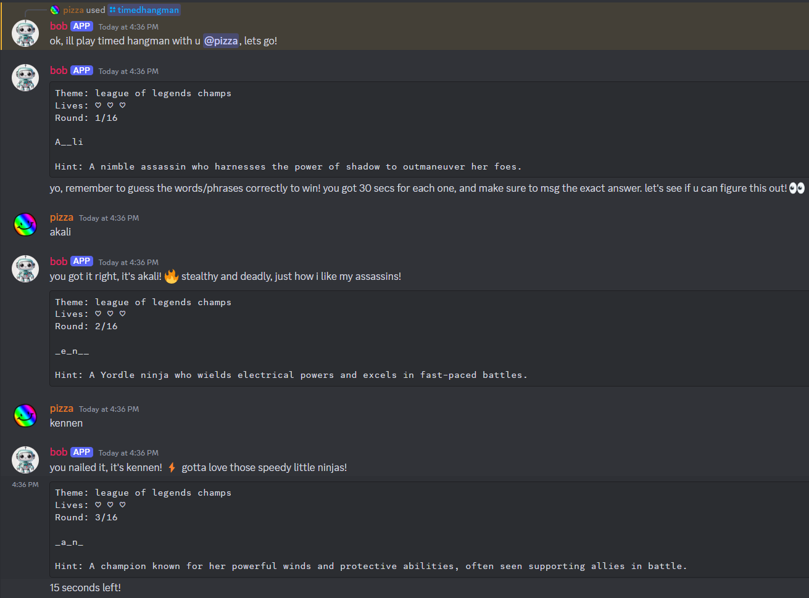

# Bob Bot

<!-- index.rst content start -->


hi i am bob 2nd edition v2.0 :D

## Demo

[Video Demo](https://www.youtube.com/watch?v=xG6uKz0mZ0E&t=340s) _(With a real-time voice call demonstration)_


_Text responses_


_Web search tool calling chain_


_Chess and vision capabilities_


_Timed hangman minigame_

## Features

See [FEATURES.md](https://github.com/Giantpizzahead/bob-bot/blob/main/FEATURES.md) for all currently implemented (and planned) features.

See [TODO.md](https://github.com/Giantpizzahead/bob-bot/blob/main/TODO.md) for the bot's todo list.

## Setup

Use **Python 3.12** in a virtual environment! Install `make` if on Windows.

```sh
# Make sure you are in a Python 3.12 virtual environment first
pip install pip-tools
pip-sync requirements.txt
playwright install
make run
```

Environment variables (some required, some optional):

- Discord token: See https://www.writebots.com/discord-bot-token/.
- Discord channels: It's best to have at most one channel per server. Use Discord's developer mode to get these IDs. Format it as a Python list of strings, ex: `['123...', '456...']`.
- OpenAI API key: See https://platform.openai.com/api-keys. Costs a bit of money, probably less than a quarter if you're just playing around.
- Serper API key: See https://serper.dev/api-key. They have a good free plan.
- Pinecone API key: See https://www.pinecone.io/product/. They also have a good free plan.
- Speech API key and region: See https://learn.microsoft.com/en-us/azure/ai-services/speech-service/. They have a good free tier.
- Uncensored intro: Use this to give context on how you want the bot to behave in uncensored mode. Be as specific as possible. Consider giving it info on inside jokes. Phrase these as guidelines, rather than trying to give specific examples to the bot. No need for extra spaces at the end. If not set, the bot will use a default uncensored intro prompt, see [responses.py](https://github.com/Giantpizzahead/bob-bot/blob/main/src/bobbot/agents/responses.py). You can use this prompt as reference for your own.

```text
DISCORD_TOKEN = Discord bot token.
DISCORD_CHANNELS = A list of channel ID strings to talk in.
OPENAI_KEY = OpenAI API key.
OPENROUTER_KEY = OpenRouter API key, for the Deepseek uncensored model.
SERPER_API_KEY = Serper API key, for Google search.
PINECONE_API_KEY = Pinecone API key, for long term memory.
SPEECH_KEY = Azure Speech SDK API key.
SPEECH_REGION = Azure Speech SDK region.
UNCENSORED_INTRO = (Optional) Custom prompt to feed to the bot when using the uncensored model.

ACTIVITIES_USERNAME = (Optional) Username for logging into all activities. Needed to use activities.
ACTIVITIES_PWD = (Optional) Password for logging into all activities. Needed to use activities.
CHESS_STATE_JSON = (Optional) Playwright state.json file, logged in as the activities user, to use for chess (copy-pasted here). Without this, the chess activity *might* fail due to a "locator timeout exceeded" error.

DEEPGRAM_KEY = (Unused) Deepgram API key.
SUPABASE_KEY = (Unused) Supabase vector store API key.
SUPABASE_URL = (Unused) Supabase vector store URL.
SUPABASE_PROJECT_PWD = (Unused) Supabase vector store password.

LANGCHAIN_API_KEY = (Development) LangChain API key for LangSmith tracing.
LANGCHAIN_PROJECT = (Development) LangChain project name for LangSmith tracing.
```

## Development

Use **Python 3.12** in a virtual environment! Install `make` if on Windows.

```sh
# Make sure you are in a Python 3.12 virtual environment first
pip install pip-tools
pip-sync dev-requirements.txt
playwright install
pre-commit install
make build
make test
```

## Issues

**Chess.com doesn't work, the locator keeps timing out.**

1. Login to chess.com locally using Playwright.
2. Save storage to `state.json`.
3. Set the environment variable `CHESS_STATE_JSON` to the copy-pasted content of `state.json`.
4. Profit
